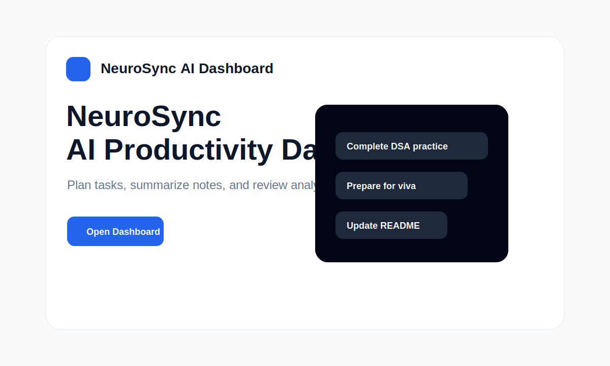
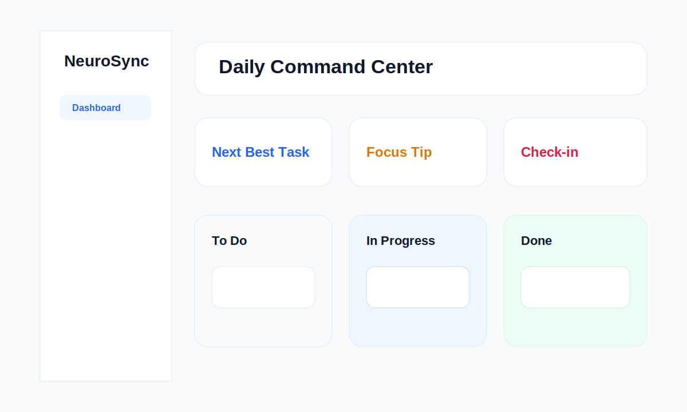

# NeuroSync AI Dashboard

NeuroSync AI Dashboard is a React productivity app for managing tasks, notes, AI-assisted planning, and workflow analytics from one clean dashboard.

## Live Routes

- `/` - Landing page
- `/login` - Login page
- `/signup` - Signup page
- `/dashboard` - Main productivity workspace
- `/analytics` - Task analytics
- `/notes` - Smart notes
- `/about` - Project information

## Features

- Landing page with hero, project intro, Open App button, and feature preview
- Login, signup, logout, and demo sign-in flow
- React Router pages for landing, dashboard, analytics, notes, about, and login
- Demo data for first-time visitors
- AI task parsing, day planning, auto scheduling, and note summaries
- Smart suggestions for next best task, focus, and procrastination checks
- Weekly productivity graph, completion streak, and focus hours
- Export PDF through print and download a text report
- Error UI for failed AI actions
- Framer Motion card animations
- Tailwind CSS interface
- Firebase-ready data layer with local-storage fallback

## Tech Stack

- React
- Firebase
- Gemini AI
- Tailwind CSS
- React Router
- Framer Motion
- Vite

## Firebase Setup

Firebase is centralized in `src/firebase.js`. Replace the placeholder values or set these Vite environment variables:

- `VITE_FIREBASE_API_KEY`
- `VITE_FIREBASE_AUTH_DOMAIN`
- `VITE_FIREBASE_PROJECT_ID`
- `VITE_FIREBASE_STORAGE_BUCKET`
- `VITE_FIREBASE_MESSAGING_SENDER_ID`
- `VITE_FIREBASE_APP_ID`

In Firebase Console, enable Authentication -> Sign-in method -> Email/Password.

## Live Demo

Live link: https://ravizf.github.io/AI-productive/

## Screenshots

### Landing Page

### Dashboard

## GitHub

Repository: https://github.com/ravizf/AI-productive

LinkedIn: https://www.linkedin.com/in/ravizf

## Built By

Built by Ravi.
